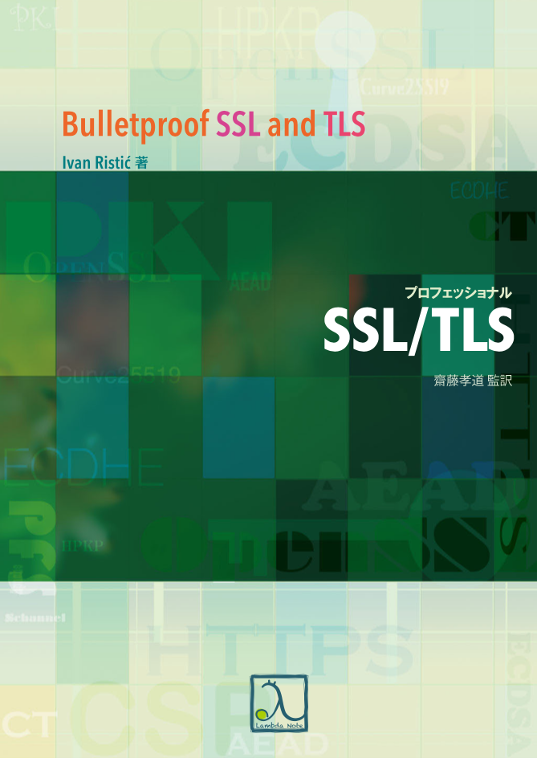

theme: Titillium

# On Password Policies
## Ryo Kajiwara @ RubyKaigi Drinkup by Agileware, 9/19/2017
### Tw: @s01, GH: @sylph01

----

# 自己紹介

## 梶原 龍(Ryo Kajiwara)
## the IDIOT(ID + IoT) engineer
## Twitter: @s01

----

# 宣伝その1:
# 『プロフェッショナルSSL/TLS』読書会
## 次回は10/6(金) 19:00
## TLSの脆弱性を解説します

----

# 宣伝その2:
## 針の音楽団 演奏会
### 9/23 15:00- @ 川口リリア（埼玉県）
### 整理券システム作ってます（9/22まで、まだ間に合う！）
### もちろん出演もします

^ 30秒かけたら長い。

----

----

#[fit] TL;DR

----

#[fit] パスワードの
#[fit] 定期更新を
#[fit] 廃止させよう

----

#[fit] その戦い方の
#[fit] 話をします

----

----

# NIST SP800-63B

- NIST(アメリカ国立標準技術研究所)によるデジタル認証のガイドライン
    - パスワードの定期的な変更を要求すべきでない
    - 文字種の組み合わせをパスワードに課すべきでない
    - 長い「パスフレーズ」を使うことが推奨
    - 二要素認証にSMSを使うのは推奨されない
    - etc...

^ 45秒かけたら長い。

----

# 現代のパスワード攻撃

- 総当り攻撃だけどリクエストを発行しまくるわけじゃない
- ハッシュ値を奪う
    - 平文パスワードなんて保存してるわけないよね？？？

----

# 記号をパスワードにつけるより長くするほうが有利

アルファベット大文字小文字: 52種類
それに数字10種・記号16種類を足した78種類

記号込み8桁: $$\log_{10}(78^8) = 15.137$$

数字・記号抜き10桁: $$\log_{10}(52^{10}) = 17.160$$

→ $$10^2$$倍 = 100倍強い！！

----

# パスフレーズが強い理由

- 現在の辞書攻撃は「単一の単語」に対して行う
- 強い辞書攻撃はそれに加えて「l33t sp34k」のような文字置き換えや数値のインクリメントに対しても攻撃をする
- 「複数単語の組み合わせ」は組み合わせる単語が増えるほど単語ベースでも探索空間が増えるのでしんどい
- 単純に長いパスワードになる

`PerlPHPJavaScriptRubyCSchemeOCamlProlog` でも十分強い。

^ 私が使った言語の順番を並べただけ

----

# 一方で「記号を使わせるな」ではない

- 選択肢狭めると探索空間小さくなって死ぬ。
- 三菱東京UFJ銀行のクレジットカードのサイト、パスワードに大文字使えないんですが、探索空間相当小さくなるのですが＞＜

----

# パスワードマネージャーを使おう

個人で使うなら1Passwordが板。Macのキーチェーン、Chromeのキーチェーンに強いパスワードを覚えさせるのでもよい。

企業で導入するならIDaaSというキーワードでいろいろ出てます。

^ IDaaSは「事情により」特にどこかに肩入れするつもりはない

----

# 会社のパスワードポリシーを殺した話

- 顧客のID基盤とかセキュリティの仕事をしていた実績があった
- その上で先程のエビデンスを突きつけて
- 正しいパスワードの付け方の講習をした
- 以前のポリシーの設定者の人に協力を得て無事パスワードの定期更新を廃止

----

# 会社のパスワードポリシーを殺した話

- 以前のポリシー変更はISMS認証取得によるものだった
- ISMSの認証基準には「ベスト・プラクティスに従え」としか書いておらず、パスワード定期変更を要求しているわけではない
    - 一方PCI-DSSには明示されている。PCI-DSSが必要なら諦めましょう
- ポリシー導入の根拠の証跡が残ってないのは「「「闇」」」

----

----

#[fit] まとめ

----

#[fit] パスワードの
#[fit] 定期更新を
#[fit] 廃止させよう

----

#[fit] 長いパスワード
#[fit] をつけよう

----

#[fit] パスワードマネージャー
#[fit] を使おう

----

#[fit] ポリシー導入時には
#[fit] 議論の過程も
#[fit] ちゃんと残そう

----

#[fit] Questions?

----

# 参考URL

- NIST SP800-63B 翻訳版 - https://openid-foundation-japan.github.io/800-63-3/sp800-63b.ja.html
- あのパスワード規則、実は失敗作だった @ THE WALLSTREET JOURNAL - http://jp.wsj.com/articles/SB12199000528276883842504583318883522596550
- 標準書に見る「パスワードの定期的変更」の歴史(書きかけ放置) @ nilnil専用チラシの裏 - http://d.hatena.ne.jp/nilnil/20131220/1387546964
